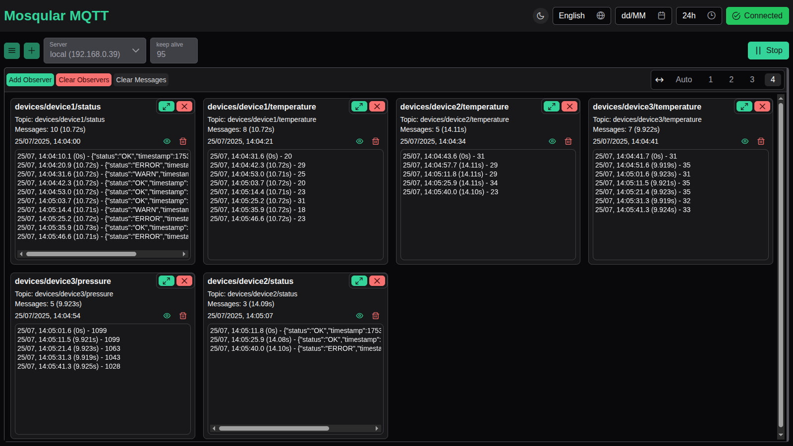

<p align="center">
  
</p>

# Mosqular MQTT

Mosqular MQTT is a web application built with **Angular** for monitoring and testing MQTT topics.  
It provides real-time message observation, topic publishing, and easy saving and switching of multiple MQTT servers.

**🌐 Use Online (wss only):**  
**[mosqular-mqtt.vinilicz.com](https://mosqular-mqtt.vinilicz.com)**

---

- [🚀 Features](#-features)
- [🛠 Technologies](#-technologies)
- [⚙️ How It Works](#%EF%B8%8F-how-it-works)
- [🌐 Internationalization](#-internationalization)
- [🎨 Themes](#-themes)
- [💾 Data Storage](#-data-storage)
- [🖼 Screenshots](#-screenshots)
- [⬇️ Installation](#%EF%B8%8F-installation)
- [ℹ️ Connection Protocol Limitation](#%E2%84%B9%EF%B8%8F-connection-protocol-limitation)


---

## 🚀 Features

- **Multiple Server Management**  
  Configure and switch between multiple MQTT brokers easily.

- **Publish & Observe Messages**  
  Publish to topics and create observers to monitor messages in real time.

- **Multi-language Support**  
  Switch between supported languages dynamically.

- **Dark/Light Mode**  
  Toggle between dark and light themes seamlessly.

- **Message Details & JSON Formatting**  
  Inspect and format JSON messages directly in the UI.

---

## 🛠 Technologies

- [TypeScript](https://www.typescriptlang.org/) – Static typing for JavaScript
- [Angular](https://angular.io/) – Front-end framework  
- [PrimeNG](https://primeng.org/) – UI components library  

---

## ⚙️ How It Works

1. **Configure Server**  
  Add broker details like host, protocol, username, and password.

2. **Connect**  
  Start the connection and monitor real-time status.

3. **Publish & Observe**  
  Publish messages to topics or create observers to watch multiple topics.

4. **Manage Observers**  
  Clear messages or remove observers individually or all at once.

---

## 🌐 Internationalization

- Supports multiple languages (English, German, Portuguese).
- Allows configuration of date and time formats:  
  - Choose between **12-hour** or **24-hour** time display.  
  - Select preferred date format: **dd/MM** (day/month) or **MM/dd** (month/day). 

---

## 🎨 Themes

- Built-in **Dark Mode** and **Light Mode**.

---

## 💾 Data Storage

- All user preferences (language, theme, server configurations) are stored **locally in the browser**.
- No server or cloud storage is required. Data persists between reloads on the same device.

---

## 🖼 Screenshots

<p align="center">
  
</p>
<p align="center">
  
  
</p>


---

## ⬇️ Installation

**Minimum required Node.js version:** `22.x`

```bash
# Install dependencies
npm install

# Run in development mode
npm start

# Build for production
npm run build
```

---

## ℹ️ Connection Protocol Limitation

Due to browser limitations, this application **can only connect to MQTT brokers via WebSocket**.  
Traditional TCP or other MQTT transport protocols are not supported in the browser environment.

Additionally, the WebSocket protocol used depends on how the app is served:  
- When running over **HTTP**, both **ws://** and **wss://** connections are supported.  
- When running over **HTTPS**, only **wss://** (secure WebSocket) connections are allowed.


> ⚠️ If your MQTT broker uses a self-signed or invalid SSL certificate,  
> you will need to explicitly allow the exception in your browser for the connection to succeed.

Please ensure your MQTT broker is configured accordingly to accept WebSocket connections for proper functionality.
